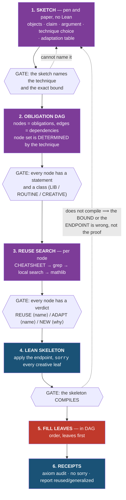
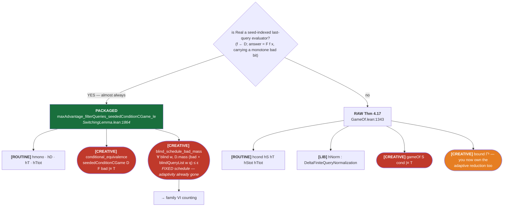

# RandomSystems proof workflows — sketch, plan, reuse, prove

**Status: design prep for a skill.** The map a skill encodes: for every technique the
library supports, the pipeline, the obligation ledger, and the line between *what the agent
may think about* and *what it must never re-derive*.

**Enforcement is process-level, not Lean-level.** There is no goal-shape tactic, no
technique typeclass, and none is planned right now. The discipline is carried by **required
artifacts** the agent must produce, in order, before it is allowed to write Lean. That is a
deliberate choice (§5), and it has a working in-repo precedent: `sequence-hash/PLAN.md` §0.5
already enforces exactly this shape by hand and by dispatch script.

Everything below is read off the current tree (`random-systems` @ `4376f54`). Claims carry a
`file:line`.

---

## 0. Why this is tractable

A general Lean proving skill is hopeless — the goal space is unbounded. This one is not,
because **every security statement in the library is an advantage bound, and the library
proves them with a closed set of seven technique families.** The *shape* of a proof is
knowable before it is attempted.

So the skill's job is not "prove Lean goals". It is to make the agent:

1. **Know what it is proving** before opening Lean — on paper.
2. **Know what it owes** — the obligation set, as a DAG.
3. **Know what already exists** — a reuse verdict on every node.
4. **Stay inside those obligations** once in Lean.

Steps 1–3 are the anti-rabbit-hole mechanism. An agent that starts in Lean without them
will reliably re-derive framework facts, invent a specialized copy of a general lemma, or
prove its way toward a bound that was never provable as stated.

---

## 1. Current assets — what actually exists in this repo

### 1.1 Packaged endpoints — the strongest asset

A packaged endpoint collapses a multi-step paper argument into one theorem whose remaining
hypotheses are *only* the creative ones. The flagship:

`RandomSystems/SwitchingLemma.lean:1864` — `maxAdvantage_filterQueries_seededConditionCGame_le`.
It folds CR18 Theorem 4.17 + the monitored-game blind reduction into an endpoint with
**exactly two creative obligations**. Compare the raw Theorem 4.17
(`RandomSystems/GameOf.lean:1343`): seven hypotheses plus the conditional equivalence, and
you own `Γᵇ` yourself.

The structural gift, and the one an agent otherwise burns a day rediscovering: **the blind
reduction has already converted an adaptive bad-event bound into a fixed-schedule one.** The
residual counting obligation is over `blindQueryList w q`, a *fixed list*. Nothing adaptive
survives to the counting layer.

Worked application: `RandomSystems/CBCMAC.lean:1073-1091` — eleven lines, of which two are
scheme-specific (`cbc_condEquiv`, `mass_cbcBad_le`). Everything else is a citation.

### 1.2 `CHEATSHEET.md` — the curated reuse index

542 lines at the repo root, organized as **"By goal — what are you trying to do?"** (`:31`)
and **"REUSE THIS — do NOT re-derive"** (`:53`), with sections for `Δ` algebra, carriers and
ideal objects, converters/DPI, switching and birthday, condition-equivalence and the blind
game, `Dist` facts, the custom tactics, AbstractCrypto indifferentiability, and the
H-technique endpoints.

**This is step 1 of every reuse search.** It is the highest-yield artifact in the repo for
exactly the failure mode the skill targets, and it is already maintained.

### 1.3 The routine-bookkeeping tactic layer

| tactic | file | discharges |
|---|---|---|
| `cr18_routine` | `CR18TacticsCore.lean:134` | standing side conditions |
| `cr18_total`, `htechnique_total` | `TotalityTactics.lean:43`, `HTechnique/Tactics.lean:79` | `KStepTotal`, `TotalOnNonempty` |
| `cr18_prob` | `CR18TacticsCore.lean:35` | `isProbDist` |
| `cr18_filter` / `cr18_game` / `cr18_transcript` | `CR18Tactics.lean:22/38/47` | `⌈q⌉` filter, `gameOf`/MBO, transcript shape |
| `cr18_arith`, `cr18_algebra`, `cr18_close` | `CR18TacticsCore.lean:68/98`, `CR18Tactics.lean:72` | the arithmetic tail |
| `htechnique_compress` | `HTechnique/Tactics.lean:45` | repeated queries → canonical injective tuple |
| `htechnique_adv_le` | `HTechnique/Tactics.lean:68` | `advPRF/advPRP/Adv ≤ ε` shell → pointwise |

**These define the `[ROUTINE]` class.** Operative rule: *if a `[ROUTINE]` tactic does not
close its goal, the model is wrong — do not write the proof by hand.* A failing `cr18_total`
means the system was defined with a partiality it should not have. Hand-proving around it
buries a modelling bug inside a proof.

`TotalityRuleSet.lean` declares the extensible `Cr18Total` aesop rule set; application layers
tag their constructor-totality lemmas at birth and `cr18_total` consults it. So the routine
inventory grows without the tactic changing.

### 1.4 The `_assemble` pattern — the seed for obligation bundles

`RandomSystems/RelateGameDistinguishing.lean:237` — `advantage_le_winProb_assemble` takes the
four substantive obligations as **explicit named hypotheses over the real objects**, then
assembles Maurer's chain. Its own docstring states the principle: *"The remaining obligations
are stated **explicitly** as hypotheses over the real objects — not as abstract reals — so
nothing is hidden."* The paper-facing endpoint above it discharges all four internally.

The same pattern, further developed, in the XoP application: `SecurityInstance`
(`Legacy/Applications/XoP.lean:68`) bundles real/ideal/bound; named obligation `def`s
(`FixedInputDensityRatioBound`, `NormalizedDensityObligation`) state each leg; and
`NormalizedCountingModel` (`:201`) is a **structure whose fields are the creative
obligations**, with proved bridge theorems into the endpoint.

**This is the right seed and it wants a redesign** — but not now. See §5.

### 1.5 The sketch-and-dispatch precedent

`sequence-hash/` runs the exact discipline this document generalizes, by hand:

- `sketches/*.md` — pen-and-paper sketches *before* Lean. `A2-sequencemac-prf.md` opens with
  the argument in prose, an `(a) OBJECTS` section, and an explicit statement of which
  technique does **not** apply and why.
- `PLAN.md` §0.5 — a standing preamble prepended to every dispatch, enforced by
  `dispatch/codex-dispatch.sh`, which **fails loudly if the sketch-adaptation discipline is
  missing**. Its §2 is a reuse-search order (CHEATSHEET first, then grep, then
  `lean_local_search`/`loogle`/`leansearch`); its §3c is the adaptation rule.
- §3c is worth quoting because it generalizes: *"the paper is a **template, not the answer**.
  NO blunt copy-paste of its bound or bad-event list. For **every** bound term and bad event,
  state in a TABLE whether a KNOWN specificity **kills / shrinks / leaves** it, and why."*

The skill's job is to make this available to every RS proof, not just SequenceHash.

### 1.6 The CNL — adjacent prior art, not the mechanism

`RandomSystemsCC/ControlledNaturalLanguage.lean` implements *proof styles* as controlled
English sentences over frozen skeletons, leaving named goals (`?good_ratio`,
`?bad_probability`, `?pointwise_ratio`, `?good_equality`), with bookkeeping dischargers that
are deliberately **not** sentences. Its stated aim (`DESIGN.md:332`) is "proofs read like
pen-and-paper".

It is real, it is compiled, and it is **not** the workflow mechanism — it is a *rendering*
of a proof once the mathematics is known. Coverage today: three H-coefficient skeletons plus
legs; condition C has only summary/transition sentences, no structure sentence exposing legs.

**Token trap, load-bearing:** promoting an English word to a parser atom spends it globally
as a Lean identifier. `CnlCrossLayerChecks.lean` documents a real parse breakage from this.
The CNL currently spends `real`, `ideal`, `bound`, `event`, `game`, `the`, `we`, `obtain`.
Anyone extending it must check for collisions first.

### 1.7 Not in this repo: `ccprover`

`ccprover/CCProver/` contains a technique map (`Surface/Techniques.lean`), a goal-shape
contract (`RS/Prover/GoalProtocol.lean`, `rs_label_goals` + eight labelled H spines), a
library primer, and an open-goal audit.

**`ccprover` depends on `random-systems`, not the reverse — none of it resolves here.** It is
**reference material only**. Two things are worth reading across for their content:

- the seven-family map and the `creative:` field per technique (`Techniques.lean:373`);
- the eight spines' **goal label names** (`GoalProtocol.lean:55-145`), which are a
  well-chosen vocabulary for the obligations and are reused as node names in §3 below.

Do not cite its tactics as available, and do not plan work against it.

### 1.8 The registry does not route you

25 `@[rs_rule]` entries across both trees: 5 `distance_bound`, 4 `rs_protocol`, 3 `rs_is_ddc`,
3 `rs_emulable`, 2 `equivalence`, and singletons. **None names a proof technique.** So the
technique layer cannot be discovered by searching the registry — which is precisely why a
skill is the right carrier for it.

---

## 2. The workflow

Six stages, three of them before Lean. Each stage has a **required artifact** and a **gate**:
you may not begin the next stage until the artifact exists.



Purple = paper. Blue = mechanical Lean. Red = the creative Lean work — and note it is
**one** stage of six, entered only after everything else is settled.

### Stage 1 — SKETCH

**Artifact:** a markdown sketch, modelled on `sequence-hash/sketches/A2-sequencemac-prf.md`.

Required content:

1. **Objects** — carriers, the real system, the ideal system, the parameters. Named, typed,
   with the existing library object each corresponds to.
2. **The claim** — the exact bound, with every parameter bound.
3. **The argument** — prose and LaTeX. What is the bad thing? Why does the good case
   coincide? Where does the loss come from?
4. **Technique choice, with the negative** — which family, which variant, *and which
   plausible alternative does not apply and why*. The A2 sketch does this explicitly ("R2 is
   not an H-technique proof… no H-coefficient representative belongs in this sketch").
5. **The adaptation table** — when the argument comes from a paper. One row per bound term
   and per bad event; columns: *term* | *kills / shrinks / leaves* | *why*. Generalized from
   `PLAN.md` §3c.

**The rule this enforces:** *the source paper is a template, not the answer.* Blunt
transcription of a paper's bound and bad-event list is the single most common way a
formalization inherits terms that this construction's own structure makes vacuous — and it
is invisible later, because the extra terms still prove, just loosely.

**Gate:** the sketch names the technique and the exact bound. If it cannot, the mathematics
is not understood yet and Lean will not help.

### Stage 2 — OBLIGATION DAG

**Artifact:** a node list with edges.

The node set is **not invented** — it is determined by the technique, and §3 gives it per
endpoint. Additional nodes come from the sketch's own intermediate lemmas.

Each node carries:

- a **name** (use the vocabulary in §3 — `good_ratio`, `bad_probability`,
  `conditional_equivalence`, `bad_event_cover`, `bad_event_leaf_sum`, …);
- a **statement**, mathematical, not Lean;
- a **class** — `[LIB]` / `[ROUTINE]` / `[CREATIVE]`;
- **dependencies** — which nodes must be proved first.

The DAG matters because **fill order is leaves-first**. A creative node proved before its
dependencies is a node proved against assumptions you have not yet fixed, and it is where
statements silently drift.

**Gate:** every node classified. If everything is `[CREATIVE]`, the routing is wrong — go
back to §3 and find the packaged endpoint.

### Stage 3 — REUSE SEARCH

**Artifact:** a verdict on every node. Exactly one of:

- **REUSE `Name`** — exists and applies as-is. Cite it; do not restate it.
- **ADAPT `Name`** — exists but is too specific. **Generalize it in place, public.** Do not
  write a specialized copy. Do not write `private`.
- **NEW** — genuinely absent, with a one-line record of what was searched.

Search order, cheapest-and-highest-yield first:

| # | tool | for |
|---|---|---|
| 1 | **`CHEATSHEET.md`** | the curated index, organized by goal. **Always first.** |
| 2 | `grep` over `RandomSystems/`, `RandomSystemsCC/`, `../abstract-crypto/` | names and idioms |
| 3 | `lean_local_search` | fast local declaration search — **before guessing a name** |
| 4 | `lean_state_search` | goal → closing lemmas |
| 5 | `lean_loogle` | mathlib by type pattern |
| 6 | `lean_leansearch` / `lean_leanfinder` | mathlib by natural language / concept |
| 7 | `lean_hammer_premise` | premise selection |

**A `NEW` verdict with no search record is not a verdict.** This is the stage that pays for
itself: the library is ~6,000 declarations with 189 notations, and a near-duplicate helper is
worse than the detour, because it splits the lemma's future maintenance.

`PLAN.md` §2 and §3b state the two sharp rules that belong here verbatim: *if the fact you
need is not scheme-specific, do not prove a specialized copy — generalize it in place*; and
*never mint a local `foo_*` generic helper; if a general fact is genuinely missing, add it
public to the framework, not to the scheme file.*

### Stage 4 — LEAN SKELETON

Apply the endpoint with a named hole at every creative obligation, `sorry` each, **compile**.

```lean
theorem my_bound … : Δ(⌈q⌉ Real, ⌈q⌉ Ideal) ≤ ε := by
  refine <endpoint> … ?obligation_one ?obligation_two
  case obligation_one => sorry
  case obligation_two => sorry
```

**Gate: it compiles.** A skeleton that does not compile means the bound is wrong as stated,
the endpoint is wrong, or a routine hypothesis is unavailable — all three are cheap now and
expensive later. This is the hard rule, no exceptions, including single-obligation proofs.

Named metavariables give `case` labels. There is no arity check — nothing warns you if the
endpoint's obligation count changes — so the DAG from Stage 2 is what you check against, by
eye.

### Stage 5 — FILL LEAVES

In DAG order, leaves first. `[ROUTINE]` nodes are tactic calls; a failure is a modelling bug.
`[CREATIVE]` nodes are the work.

### Stage 6 — RECEIPTS

Axiom audit the endpoint (`lean_verify` / `#print axioms`; only `propext`,
`Classical.choice`, `Quot.sound`). No residual `sorry`. Report which theorems were reused and
what was generalized — that report is what keeps Stage 3 honest over time.

---

## 3. Per-technique obligation ledgers

Legend: `[LIB]` cite it, never re-prove · `[ROUTINE]` run the tactic, a failure is a modelling
bug · `[CREATIVE]` the work.

### 3.1 Routing

```
0. Is the distance ZERO?        → family I. CHECK FIRST.
1. Can Δ be split or stripped?  → family II reshape.
2. What is the "bad thing"?     → family III — THE choice point:
     a bad TRANSCRIPT           → H-technique
     a CONDITION the adversary triggers (adaptive/stateful)
                                → conditional equivalence
     DISAGREEMENT under shared randomness
                                → coupling
     the adversary WINNING a given game
                                → winnability
3. Discharge the probability    → family VI counting.
4. Arithmetic                   → cr18_arith / cr18_algebra / cr18_close.
```

Two omissions to pre-empt, both common:

- **Family I is skipped in favour of a bound.** `δ = 0` (behavioural quotient, relabelling
  invariance, non-adaptive sufficiency) beats every `δ ≤ ε`.
- **Family II is the step most often omitted.** Attacking `Δ(Real, Ideal)` head-on when a
  hybrid splits it into two easy halves is the most common self-inflicted difficulty here.

### 3.2 H-technique — the bad thing is a **transcript**

Fifteen entry points, `RandomSystems.CR18.HTechniqueDerivation.adv_le_of_⟨model⟩_⟨analysis⟩[_⟨filter⟩]`,
from three orthogonal axes:

```
  transcript model : fixedQuery | extended | extFixedQuery | extFixedQueryRep
  analysis         : eq_on_good | ratio_of_good | ratio | expectation | partition
  query filter     : —          | filtered      | filtered_of_filter
```

and the five analyses are specialisations of one lemma:

```
hTechnique_partition   (∀a, (1 − ε_{cell a})·ideal a ≤ real a)  ⟹  δ ≤ Σᵢ εᵢ·Pr[cell = i]
  ├── hTechnique_expectation      cell := the point itself
  ├── hTechnique_ratio            two cells: bad ↦ 1, good ↦ ε
  │     └── hTechnique_eq_on_good   … with ε = 0 on good
  └── oneSided_hTechnique         one cell
```

**Take the most special variant that applies** — fewest obligations. Not every combination
exists; check `CHEATSHEET.md` §9 for what the library actually provides.

| analysis | `[CREATIVE]` nodes |
|---|---|
| perfect (`ratio`) | `pointwise_ratio` |
| `eq_on_good` | `good_transcript_equality`, `ideal_bad_probability` |
| `ratio_of_good` | `good_transcript_ratio`, `ideal_bad_probability` |
| `expectation` | `pointwise_defect_ratio`, `ideal_bad_probability`, `ideal_good_defect_expectation` |
| `partition` | `cell_defect_ratio`, `weighted_cell_bound` |
| `extended` | `extended_good_ratio`, `extended_ideal_bad_probability` (+ 2 routine projections) |
| `extFixedQueryRep` | `representative_good_ratio`, `representative_ideal_bad_probability` |

`[ROUTINE]`: `KStepTotal` ×2 (`htechnique_total`), `FiniteTranscriptSpace` /
`DiscreteTranscriptSpace` (`inferInstance` — `abbrev`s at `CR18Names.lean:37,48`), query
compression (`htechnique_compress`).

**Traps.** Never reverse the ratio — ideal on the left, real on the right:
`(1 - ε) * ideal t ≤ real t`. `ideal_bad_probability` is `∀ E : QQueryEnvironment`, so bound
it **uniformly**; a per-schedule bound does not discharge it.

### 3.3 Conditional equivalence — the bad thing is a **condition the adversary triggers**



Worked example `CBCMAC.lean:1073`; its two creative inputs are `cbc_condEquiv` (`:928`, a
re-randomisation / fiber-balance argument) and `mass_cbcBad_le`. `CHEATSHEET.md` §5 covers
this layer top-down and names the seed-indexed endpoint as "the single source of truth".

**The rabbit hole:** an agent on the raw door inherits `Γᵇ` and starts reasoning about
adaptive adversaries. *If you are reasoning about what an adaptive distinguisher might do,
you took the wrong door.*

### 3.4 Coupling — the bad thing is **disagreement**

`coupling_bound (C : DistCoupling X Y) : statDist X Y ≤ C.prDisagree` (`Coupling.lean:136`,
`DistCoupling` at `:41`).

`[CREATIVE]`: the joint distribution; the `prDisagree` bound. `[ROUTINE]`: the two marginals,
if the joint was built right.

Two facts that end whole categories of deliberation — **cite, never re-litigate**:
`system_coupling_exists` (a coupling always exists; `Legacy/SystemCoupling.lean`) and
`optimal_probability_coupling_exists` (the optimal coupling's disagreement **equals** `Δ`, so
so the *technique* has no inherent slack; `RandomSystemCoupling.lean`).

**But a coupling you construct is lossy until shown optimal.** `coupling_bound` is an
inequality. `SoP2.lean` builds both kinds of the same system pair: Proposition 5's *maximal*
coupling gives Theorem 6, an **equality**; Proposition 8's *online* coupling gives Corollary
9's `2q³/3N²`, and the source calls it "weaker than the optimal coupling above". The trade is
deliberate — the maximal coupling is exact but leaves you a hard quantity to estimate, the
online one is loose but bounds step by step. When a coupling bound looks slack, say **which**
of the two is the source.

### 3.5 Winnability — the bad thing is **the adversary winning**

`theorem_2_37_winnability_theorem` (`LanzenbergerChain.lean:281`); the proved workhorse is
`winnability_theorem_of_fixed_domain_and_bounded` (`GameWinnability.lean`). `[CREATIVE]`: the
MBO and the winning-probability bound. Overlaps CE heavily — **prefer CE** unless the game is
given rather than derived.

### 3.6 Condition-based (Maurer EC'02) — legacy layer

`statDist_le_conditionFailure_single` (`Legacy/ConditionBased.lean:241`), with
`TranscriptCondition` (`:60`) and `maxConditionFailure` (`:88`). Lives in the legacy struct
model, not the PFun next-gen surface. **Default to conditional equivalence instead**; reach
for this only when already inside the legacy layer.

### 3.7 Family II — reshape

| move | lemma | you supply |
|---|---|---|
| hybrid / triangle | `maxAdvantage_triangle` | **the intermediate system** — the only creative bit |
| data processing | `maxAdvantage_apply_le` | the converter + `Emulable` |
| parallel | `maxAdvantage_par_le` | nothing (4 `isProbDist`) |
| query restriction | `maxAdvantage_filterQueries_le` | nothing (2 `TotalOnNonempty`) |
| branch additivity | `delta_sum_cons_pushforwards_…` | the disjoint cell decomposition |
| descent | `maxAdvantage_le_of_forall_advantage_le` | nothing — but it fixes `D` |

`CBCMAC.lean:1099-1118` is a headline theorem with **no new mathematics**: triangle, DPI hop,
switching lemma.

### 3.8 Family VI — counting

| door | lemma |
|---|---|
| union bound | `probBad_iUnion_le` (`StatDist.lean:294`) — nodes `bad_event_cover`, `bad_event_leaf_sum` |
| union bound (mass) | `mass_biUnion_le` (`SwitchingLemma.lean:55`) |
| ratio trick | `probBad_le_of_ratio` (`HTechnique/Derivation.lean:3499`) |
| structure graphs | `CBCStructureGraph.lean` (Jha–Nandi) |
| orbit / partition counting | `SoP/`, `CompatibleCount.lean` |
| collision / birthday | `SwitchingLemma.lean`, `Instances.URFfunEval` |

**The choice of descriptor family is the creative act** — it turns "some bad thing happened"
into "one of these named, individually-countable things happened". A slack cover costs you
the bound, not the proof: refine the family, do not hunt for a cleverer sum bound.

### 3.9 The metric receipt

`maxEDist ≤ ofReal Δ` unconditionally; **`=` on the shared-domain subcarrier**, via
`StrictContextSharedDomain.maxEDist_filterDom_eq_ofReal_maxAdvantage` (applied at
`CBCMAC.lean:1875,1891`). State headline results in `Δ` and attach the equality receipt.
Accepting `≤` where `=` is available is silent slack in a headline bound.

---

## 4. Anti-rabbit-hole rules

1. **No Lean before the sketch.** If you cannot name the technique and the bound on paper,
   Lean will not tell you.
2. **No Lean before every node has a reuse verdict.** A `NEW` with no search record is not a
   verdict.
3. **Statement-first, hard rule.** The skeleton compiles before any hole is filled.
4. **A failing `[ROUTINE]` tactic is a modelling bug.** Fix the definition, never hand-prove
   around it.
5. **Reasoning about an adaptive distinguisher ⟹ wrong door.** Every packaged endpoint has
   already done that reduction.
6. **Manipulating statistical distance directly ⟹ you skipped family II.**
7. **Check family I first.** `δ = 0` beats every `δ ≤ ε`.
8. **Most special variant wins.** Generality costs obligations.
9. **Never reverse the H ratio.** Ideal left, real right.
10. **Generalize in place; never a specialized copy; never `private`.**
11. **The paper is a template, not the answer.** Fill the adaptation table.
12. **Verify the passed-forward premise.** Papers are read **visually** — text extraction
    fails silently in this repo's paper set.
13. **After the second failed fix of the same goal, restate — do not patch.** The difficulty
    is usually self-inflicted: wrong statement shape, or hand-rolled infrastructure that
    duplicates something in the tree.

---

## 5. Deferred: Lean-level enforcement

**Decision (2026-07-30): none, for now.** No goal-shape tactic, no technique typeclass. The
workflow is carried by the skill and by the artifacts it requires. Reasons: the surface is
still moving; process discipline can be revised in an afternoon where a Lean contract cannot;
and the sequence-hash precedent shows the process form already works.

Recorded for when that changes — the redesign of the `_assemble` pattern (§1.4), which is the
right seed:

> Render each technique as a **structure whose fields are exactly the creative obligations**,
> with the routine side conditions as **typeclass binders**, plus one proved elimination
> theorem to the bound. That makes the creative/routine split *the same distinction as*
> field-vs-instance-binder: fields you must supply, instances the elaborator finds. The
> obligations become addressable by name, a half-built proof is a value with `sorry` in one
> field, and nesting a counting structure inside a technique structure is literally the DAG.
>
> The enabling inventory already exists: the `Cr18Total` aesop rule set is the collected list
> of routine-totality facts, and those are exactly what would be re-tagged as instances.

Also deferred, and cheaper: extending the CNL (§1.6) with a **structure sentence for
condition C** — today it has only summary/transition sentences, so the CE legs are never
exposed as named goals the way the H legs are. Check the atom-collision table first.

---

## 5b. What the first runs measured (2026-07-30/31)

Three dispatches against `cbc_mac_randomness_expander`, with the reference proof held out.
Verified from artifacts (axiom audit, proof-term dependency walk), not from agent testimony.

| run | route | outcome | cost |
|---|---|---|---|
| 1, free routing | CE, packaged endpoint | proved, axiom-clean | ~11-line `calc`, all citations |
| 2, H prescribed | H, one-cell `ratio` | proved, axiom-clean, statement unchanged | **~90 lines of glue** |

**Routing has a measurable cost, on this theorem.** Both doors close; the wrong one costs
~90 lines producing no new mathematics.

Findings that changed the skill:

1. **`htechnique_compress` is not free.** The skill said "query compression is a
   normalisation, never creative". True mathematically; false mechanically — the tactic is a
   fixed rewrite set, and off those shapes the step is hand work (~60 lines here:
   re-indexing `Fin q` to the distinct-message subtype, plus an inconsistent-answer-vector
   branch with no counterpart in the paper, because H quantifies over transcripts neither
   system can produce). **Fixed.**
2. **Routing must consult `CHEATSHEET.md` §9's route warning**, which says a proof is either
   a `Δ`/blind-game proof or an H-technique proof and the two must not be mixed. It was cited
   in the skill only for *reuse*. **Fixed.**
3. **The `[ROUTINE]` tactics are not globally available.** `CBCMAC.lean` imports none of the
   tactic modules, so `cr18_total` does not resolve there. **Fixed** (import column + note).
4. **The gates do not hold.** Across 67 tool calls and two dispatches, an agent that had read
   `sketch-and-plan.md` produced **zero** sketch files and went straight from grepping to
   editing. With no enforcement, the gate framing was a false promise. **Reframed**: the
   sketch is now "your first deliverable", justified by reviewability rather than compliance.
   A `PreToolUse` hook blocking `.lean` edits until a sketch exists remains the option if
   teeth are wanted.
5. **Proof shape was unaddressed and is the biggest readability gap.** Run 2's proof buried
   its chain in nested `refine le_trans (…) ?_`: no sequence of quantities, no sign of which
   H analysis was running. **Added**: a Proof-shape section — top-level `calc` one line per
   hop, creative obligations as named `have`s before the chain, the bad event named, the
   variant stated, routine plumbing hoisted.
6. **The CBC worked example made the skill a lookup table.** It printed the calc skeleton and
   named all four inputs, so the first test collapsed stages 1–3 into one read. **Replaced**
   by a shape-only description with an explicit "do not open before routing".

Methodology error worth recording: run 2's prompt asked *"was this the right technique? do
not force a proof you do not believe in"* and permitted `sorry`. It returned exactly that
conclusion, unproved. Re-dispatched with only "finish it, zero sorry", it closed. **Never
pass a conclusion-shaped constraint or another agent's unverified claim to a subagent** —
doing so launders a guess into evidence.

Also found incidentally: `CBCMAC.lean:954`'s docstring cites `cbc_urp_substitution`, which
exists nowhere in the tree.

## 6. Skill design

Against the ToB house standard (`skills-internal/CLAUDE.md`): SKILL.md under 500 lines,
progressive disclosure, references one level deep, `## When to Use` + `## When NOT to Use`
required, and — because proof work is fragile — `## Rationalizations to Reject`.

**One router skill plus four references.** The routing decision is the point; splitting it
across skills hides the choice.

```
.claude/skills/random-systems-proofs/
  SKILL.md                          — the six stages and their gates, routing,
                                      the ledger legend, rationalizations
  references/
    sketch-and-plan.md              — §2 stages 1–3: sketch template, DAG, reuse search order
    h-technique.md                  — §3.2
    conditional-equivalence.md      — §3.3, the two doors, CBC worked example
    counting.md                     — §3.8
    reshape-and-exact.md            — §3.4–3.7, §3.9
```

Commitments, each earned above:

- **Behavioural guidance, not a reference dump.** ~6,000 declarations; the skill teaches the
  search order and the routing questions, and points at `CHEATSHEET.md` rather than copying it.
- **Prescriptive, because the task is fragile.** Gates, not suggestions.
- **The dev loop is `lean-lsp` MCP** (`lean_goal` gives the actual proof state), falling back
  to `lake env lean <file>`. `lake build` only for stale oleans. In every subagent brief too.
- **No verification scaffolding in prompts** — per house standard it makes output worse. The
  checks are the compile gate and the axiom audit.
- **Ships an eval case.** `claude plugin eval … --ablation with-without`. The natural case: a
  small real bound with a known technique, graded on whether the agent produces the sketch and
  the reuse verdicts *before* Lean, picks the right door, and reuses rather than re-derives.
  Pair the LLM grader with a deterministic assertion — a grader reading a transcript will pass
  a run that *described* the work.

---

## Appendix — source index

| what | where |
|---|---|
| Curated reuse index | `CHEATSHEET.md` (start here, always) |
| Packaged CE endpoint | `RandomSystems/SwitchingLemma.lean:1864` |
| Theorem 4.17 entry points | `RandomSystems/GameOf.lean:1343,1359,1383` |
| CE definition `\|≡`, `TotalOnNonempty` | `RandomSystems/CondEquiv.lean:118,96` |
| CE worked example, metric receipts | `RandomSystems/CBCMAC.lean:928,1073,1875` |
| Obligation-bundle seed | `RandomSystems/RelateGameDistinguishing.lean:237`; `Legacy/Applications/XoP.lean:68,201` |
| H-technique derivations, ratio trick | `RandomSystems/HTechnique/Derivation.lean` |
| Coupling | `RandomSystems/Coupling.lean:41,136` |
| Winnability | `RandomSystems/GameWinnability.lean`, `LanzenbergerChain.lean:281` |
| Union bound | `RandomSystems/StatDist.lean:294`, `SwitchingLemma.lean:55` |
| Routine tactics | `CR18Tactics{,Core}.lean`, `TotalityTactics.lean`, `HTechnique/Tactics*.lean`, `TotalityRuleSet.lean` |
| Typeclass obligations | `RandomSystems/CR18Names.lean:37,48` |
| Counting engines | `CBCStructureGraph.lean`, `SoP/`, `CompatibleCount.lean` |
| CNL proof styles | `RandomSystemsCC/ControlledNaturalLanguage.lean`, `CnlCrossLayerChecks.lean` |
| Sketch + dispatch precedent | `sequence-hash/PLAN.md` §0.5, `sequence-hash/sketches/` |
| External reference only | `ccprover/CCProver/Surface/Techniques.lean`, `RS/Prover/GoalProtocol.lean` |
